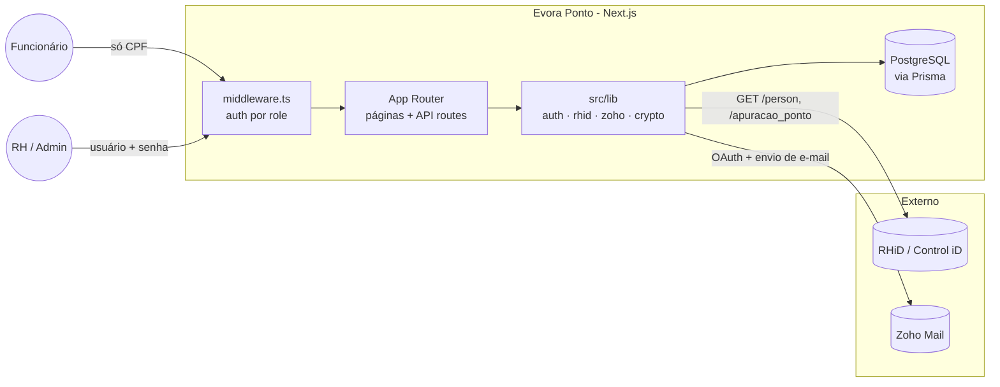
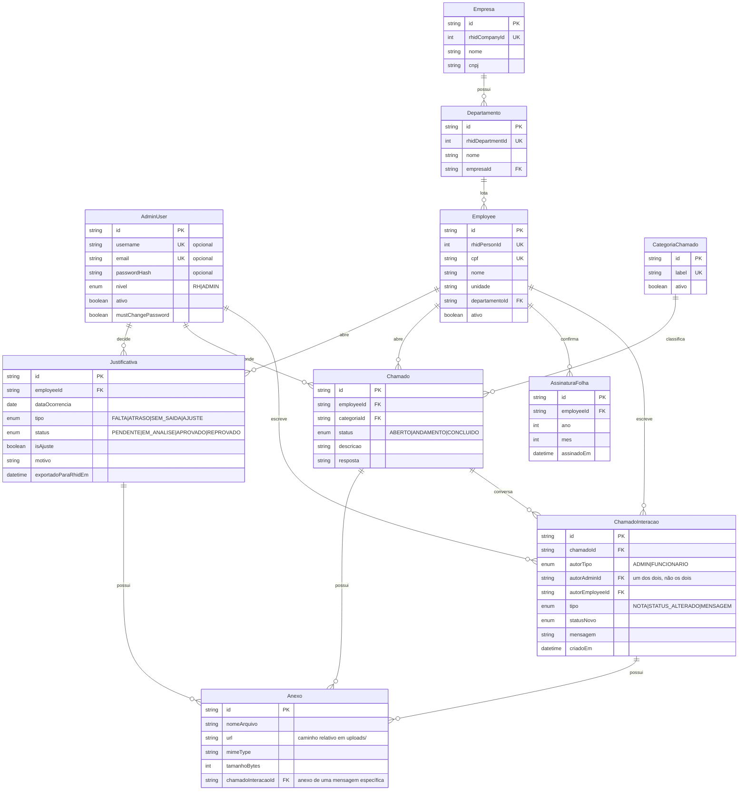
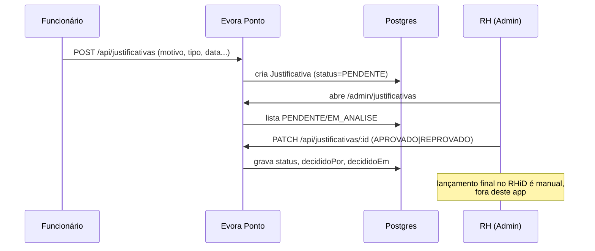
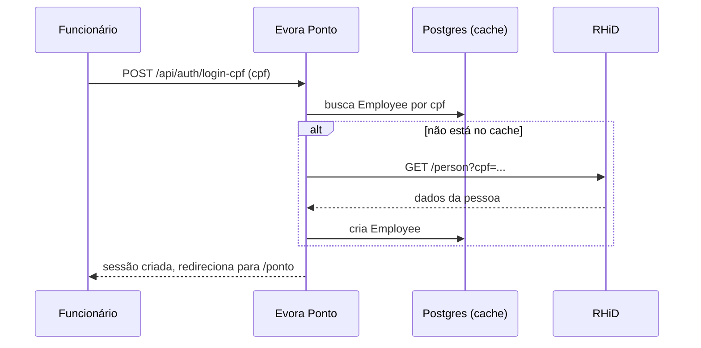
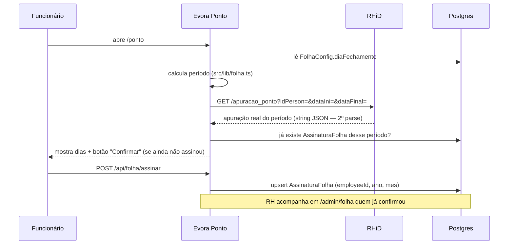
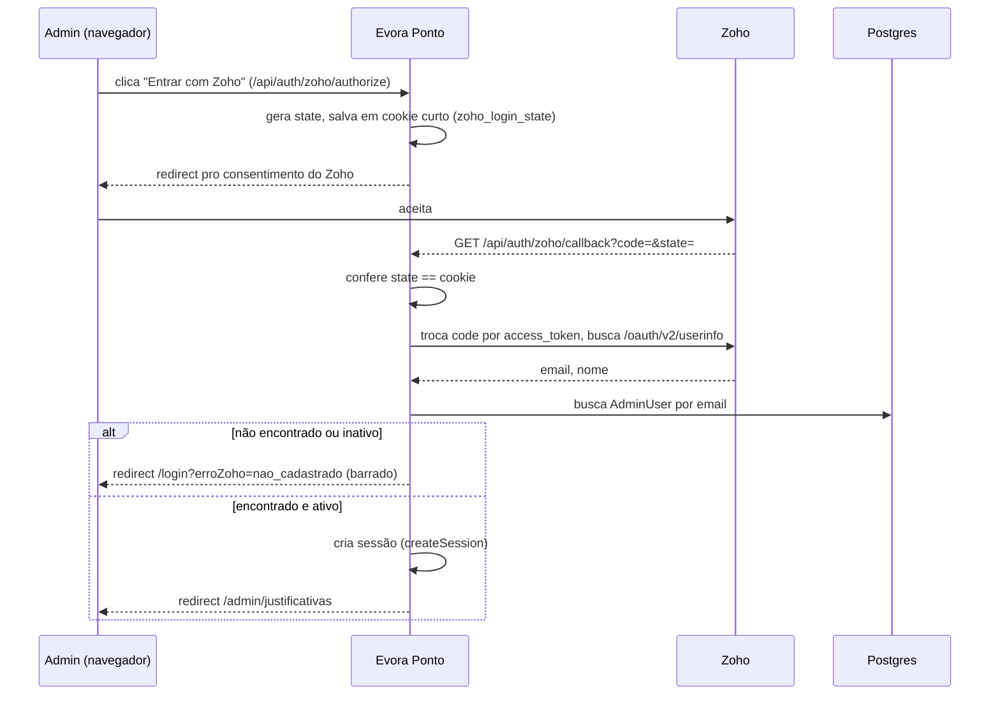

# Arquitetura — Evora Ponto

Este documento complementa o [README.md](../README.md) (que cobre setup e
configuração) com uma visão técnica mais profunda: arquitetura geral, modelo
de dados, fluxos e referência de API. Use-o como mapa para navegar o código.

## 1. Visão geral

Evora Ponto é uma camada de **workflow e aprovação** sobre o sistema de ponto
real da empresa (RHiD/Control iD). Ele não mede nem calcula horas — isso
continua sendo responsabilidade do RHiD. O que este app resolve:

- Funcionário registra uma **justificativa** (falta, atraso, sem saída, ajuste)
  ou um **pedido de ajuste** para uma data específica.
- Funcionário abre um **chamado** com o RH em uma categoria pré-definida.
- RH revisa tudo isso em um painel (visão tabela ou kanban), aprova/reprova
  justificativas e responde chamados.
- O lançamento final no RHiD continua **manual** (não há endpoint de escrita
  na API do RHiD para isso — ver README).

## 2. Perfis e autenticação

Sessão própria via cookie `evora_session` (JWT assinado com `jose`,
`src/lib/auth.ts`), válido por 10h, `httpOnly`. Não há provedor externo
(NextAuth/Auth0) nem SSO.

| Perfil | Login | Payload da sessão | Rotas protegidas |
|---|---|---|---|
| `EMPLOYEE` | só CPF, sem senha | `employeeId, cpf, nome, unidade` | `/ponto/*`, `/chamados/*` |
| `ADMIN` | usuário+senha OU Zoho OAuth | `adminId, username, name, nivel` | `/admin/*` |

`src/middleware.ts` lê e valida o JWT a cada request e redireciona para
`/login` se o `role` não bater com o grupo de rota. O funcionário não tem
senha — CPF sozinho já autentica (decisão consciente, ver nota de segurança
no README).

`AdminUser` tem dois caminhos de login possíveis, mutuamente exclusivos por
conta (`username`+`passwordHash` OU só `email`):
- **Usuário e senha** — `/api/auth/login-admin`, fluxo de sempre.
- **Zoho OAuth** — `/api/auth/zoho/authorize` → consentimento no Zoho →
  `/api/auth/zoho/callback` troca o `code` por identidade
  (`exchangeZohoLoginCode()` em `src/lib/zoho.ts`) e busca `AdminUser` pelo
  e-mail retornado. Sem sessão prévia (é o próprio login) — por isso usa um
  cookie de curta duração (`zoho_login_state`, 5min) pro anti-CSRF do OAuth
  em vez do cookie de sessão normal. **E-mail que não bate com nenhuma
  conta ativa é barrado**, volta pro `/login` com `?erroZoho=nao_cadastrado`
  sem criar sessão nenhuma.

Dentro de `ADMIN` existe um segundo nível, `nivel` (`RH` ou `ADMIN` —
`AdminUser.nivel`, enum `NivelAdmin`): `RH` só acessa telas de atendimento
(Justificativas, Chamados, Folha de Ponto, Funcionários); `ADMIN` também
acessa Configurações e Administradores. Checado em dois lugares — o
middleware bloqueia por path (`ROTAS_NIVEL_ADMIN` em `src/middleware.ts`) e
cada rota de API sensível chama `requireNivelAdmin()` (`src/lib/auth.ts`) em
vez do `requireAdmin()`/checagem de `role` simples. `AdminShell` também
esconde os itens de nav de quem é nível `RH`, mas isso é só UX — a proteção
de verdade é o middleware + as rotas de API.

## 3. Modelo de dados

Pontos que não são óbvios olhando só o schema:

- **`Employee` é um cache local**, sincronizado a partir do RHiD
  (`GET /person`). O RHiD é a fonte da verdade para dados cadastrais; este
  app não cria funcionário, só espelha.
- **`exportadoParaRhidEm`** existe porque a aprovação aqui não grava no
  RHiD — esse campo marca manualmente quando o RH já lançou a justificativa
  aprovada na tela de "Atribuições em massa" do RHiD.
- **`ZohoConfig` e `RhidConfig`** guardam segredos criptografados em repouso
  (`src/lib/crypto.ts`), nunca em texto puro — inclusive `clientSecretEnc`,
  `refreshTokenEnc`, `accessTokenEnc` e `integrationPasswordEnc`.
  `RhidIntegrationToken` é só o cache do token de sessão do RHiD (não é
  segredo de longa duração, expira em ~45min).
- **`AssinaturaFolha`** é o aceite do funcionário sobre um período — um
  registro por `employeeId + ano + mes` (chave única). Não é assinatura
  criptográfica, é só "fulano confirmou X em Y". O período em si (datas de
  início/fim) não é persistido — é recalculado sob demanda em
  `src/lib/folha.ts` a partir de `FolhaConfig.diaFechamento`.
- **`ChamadoInteracao`** é o histórico de atendimento — um registro por
  troca de status (`STATUS_ALTERADO`), gravado junto com o `PATCH
  /api/chamados/[id]` na mesma transação. `Chamado.respondidoPor`/
  `respondidoEm` continuam existindo como o "resumo" (última decisão) usado
  nas listagens; `ChamadoInteracao` é a trilha completa (quem atendeu,
  quem concluiu, quando).
- **`Empresa`/`Departamento`** são o cadastro local de `GET /company` e
  `GET /department` do RHiD — não são um dado novo do app, são o cadastro
  organizacional real, sincronizado junto com os funcionários (ver
  `syncEmpresasEDepartamentos()` em `src/lib/rhid.ts`). `Employee.unidade`
  (string solta, usada nos filtros existentes) é uma cópia de
  `Departamento.nome` feita na sincronização — não é a fonte da verdade, só
  um espelho pra não precisar mudar todo o código que já lia `employee.unidade`.
- **`AdminUser.ativo`** — desativar um admin nunca é um `delete`. Como
  `Justificativa.decididoPor`, `Chamado.respondidoPor` e
  `ChamadoInteracao.autor` apontam pra `AdminUser`, excluir de verdade
  quebraria o histórico. `ativo=false` bloqueia os dois caminhos de login
  (usuário/senha e Zoho) sem perder a atribuição de quem decidiu o quê.
- **`AdminUser.username`/`passwordHash`/`email` são todos opcionais** — a
  regra "username+senha OU só email" é reforçada na validação da API
  (`src/app/api/admin/administradores/route.ts`, `z.union` de dois
  schemas), não por uma constraint de banco. Se for mexer nesse model
  direto (seed, script), lembrar de manter essa regra na mão.

## 4. Referência de API

Todas as rotas ficam sob `src/app/api/`. Nenhuma delas é pública sem sessão,
exceto onde marcado.

### Autenticação

| Rota | Método | Descrição |
|---|---|---|
| `/api/auth/login-cpf` | POST | Login do funcionário, só CPF; confirma no RHiD se o CPF ainda não está no cache local |
| `/api/auth/login-admin` | POST | Login do RH (usuário/senha); 400 se a conta for só-Zoho (sem `passwordHash`) |
| `/api/auth/change-password` | POST | Troca de senha do RH (obrigatória no 1º acesso) — não se aplica a EMPLOYEE nem a admin só-Zoho |
| `/api/auth/logout` | POST | Encerra a sessão |
| `/api/auth/zoho/authorize` | GET | Público (é o início do login) — redireciona pro consentimento do Zoho |
| `/api/auth/zoho/callback` | GET | Callback do Zoho — confere e-mail contra `AdminUser`; cria sessão ou barra (`?erroZoho=`) |

### Justificativas

| Rota | Método | Quem | Descrição |
|---|---|---|---|
| `/api/justificativas` | GET | EMPLOYEE/ADMIN | Lista (filtrada por funcionário logado, ou todas para o RH); admin sem `status`/data explícitos não vê Aprovado/Reprovado por padrão (`?dataInicio=&dataFim=` revela). Pro EMPLOYEE, abrir a lista marca as decididas como vistas (some com o badge — ver decisão abaixo) |
| `/api/justificativas` | POST | EMPLOYEE | Cria uma nova justificativa/pedido de ajuste |
| `/api/justificativas/[id]` | GET | EMPLOYEE/ADMIN | Detalhe de uma justificativa |
| `/api/justificativas/[id]` | PATCH | ADMIN | Aprova/reprova, grava `decididoPor` e `decididoEm` |

### Chamados

| Rota | Método | Quem | Descrição |
|---|---|---|---|
| `/api/chamados` | GET | EMPLOYEE/ADMIN | Lista chamados; admin sem `status`/data explícitos não vê Concluído por padrão (`?dataInicio=&dataFim=` revela). Para EMPLOYEE, é paginado (`?page=&pageSize=`, padrão 10/página, máx. 50), cada item tem `novaResposta` (badge — só considera chamado Em andamento, ver decisão abaixo), e retorna `{ items, total, page, pageSize }`; para ADMIN continua retornando um array simples com todos os itens filtrados (sem paginação — ver decisão de design abaixo) |
| `/api/chamados` | POST | EMPLOYEE | Abre um novo chamado |
| `/api/chamados/[id]` | GET | EMPLOYEE/ADMIN | Detalhe de um chamado, incluindo `interacoes` (conversa completa: mensagens dos dois lados + trocas de status, cada mensagem com seus `anexos`) |
| `/api/chamados/[id]` | PATCH | ADMIN | Só muda status (`ABERTO`/`ANDAMENTO`/`CONCLUIDO`); não pede/aceita texto — ver `/mensagens` |
| `/api/chamados/[id]/mensagens` | POST | EMPLOYEE/ADMIN | `multipart/form-data`: campo `mensagem` (obrigatório) + até 5 `anexos`. Envia uma mensagem na conversa; funcionário só no próprio chamado. Mensagem do funcionário num chamado Concluído reabre sozinho pra Em andamento; primeira mensagem do RH num chamado Aberto muda sozinho pra Em andamento |
| `/api/anexos/[id]` | GET | EMPLOYEE/ADMIN | Serve o arquivo de um anexo (streaming, com `Content-Type`/`Content-Disposition` corretos); funcionário só acessa anexo de algo que é dele |
| `/api/categorias-chamado` | GET | EMPLOYEE/ADMIN | Lista categorias ativas |
| `/api/categorias-chamado` | POST | ADMIN | Cria categoria |
| `/api/employee/pendencias` | GET | EMPLOYEE | Contadores pros badges do menu inferior: chamados com resposta nova (só Em andamento) e justificativas com decisão nova. Só lê — não marca nada como visto |

### Folha de ponto

| Rota | Método | Quem | Descrição |
|---|---|---|---|
| `/api/folha/minha` | GET | EMPLOYEE | Apuração do RHiD + status de assinatura do período (atual, ou `?ano=&mes=` pra navegar por períodos anteriores); inclui `podeAssinar` (só true no dia de fechamento do período consultado) |
| `/api/folha/assinar` | POST | EMPLOYEE | Confirma a folha do período atual (upsert em `AssinaturaFolha`); 400 se hoje não for o dia de fechamento (ver `podeAssinarHoje` em `src/lib/folha.ts`) |
| `/api/admin/folha/assinaturas` | GET | ADMIN | Todo funcionário ativo x status de assinatura do período (atual, ou `?ano=&mes=` pra navegar por períodos anteriores) |
| `/api/admin/settings/folha` | GET/POST | ADMIN | Lê/salva `diaFechamento` |

### Funcionários e estrutura organizacional

| Rota | Método | Quem | Descrição |
|---|---|---|---|
| `/api/admin/funcionarios` | GET | ADMIN (RH ou Admin) | Lista o cache local (`Employee`), com filtro `?unidade=&status=&q=` |
| `/api/admin/departamentos` | GET | ADMIN (RH ou Admin) | Lista `Departamento` — popula os filtros de unidade nas 3 telas acima |

### Administradores

| Rota | Método | Quem | Descrição |
|---|---|---|---|
| `/api/admin/administradores` | GET | nível ADMIN | Lista todos os `AdminUser` (sem `passwordHash` — vem só `temSenha: boolean`) |
| `/api/admin/administradores` | POST | nível ADMIN | Cria um admin: `{modo:'senha', username, senha, ...}` ou `{modo:'zoho', email, ...}` |
| `/api/admin/administradores/[id]` | PATCH | nível ADMIN | Muda `nivel`/`ativo`, ou gera senha nova (`resetarSenha: true` — só se a conta tiver `username`; retorna a senha uma única vez) |

### Integrações

| Rota | Método | Quem | Descrição |
|---|---|---|---|
| `/api/rhid/apuracao` | GET | EMPLOYEE/ADMIN | Proxy para a apuração de ponto do RHiD |
| `/api/admin/settings/rhid` | GET/POST | nível ADMIN | Lê/salva URL base, e-mail e senha do usuário de integração do RHiD |
| `/api/admin/rhid/test` | POST | nível ADMIN | Força login novo no RHiD e confirma que a credencial funciona |
| `/api/admin/rhid/sync` | POST | nível ADMIN | Dispara `syncTudoDoRhid()` sob demanda (empresas → departamentos → funcionários) |
| `/api/integrations/zoho/authorize` | GET | nível ADMIN | Inicia o fluxo OAuth do Zoho |
| `/api/integrations/zoho/callback` | GET | — (callback do Zoho) | Troca o `code` por tokens e salva criptografado |
| `/api/admin/settings/zoho` | GET/POST | nível ADMIN | Lê/salva Client ID e Secret do Zoho |

## 5. Fluxos principais

### Justificativa de ponto

### Login do funcionário

### Assinatura da folha de ponto

### Login de admin via Zoho OAuth

## 6. Variáveis de ambiente

Ver `.env.example` para a lista completa. As mais relevantes para entender o
comportamento do app:

| Variável | Uso |
|---|---|
| `DATABASE_URL` | conexão Postgres (Prisma) |
| `AUTH_SECRET` | assina o cookie de sessão (JWT) |
| `APP_ENCRYPTION_KEY` | criptografa segredos do RHiD/Zoho em repouso |
| `RHID_API_BASE_URL` | base da API do RHiD — **precisa terminar em `/api.svc`** (ver `docs/integrations/rhid-swagger.json`) |
| `RHID_INTEGRATION_EMAIL` / `RHID_INTEGRATION_PASSWORD` | credencial de integração dedicada no RHiD (não usar login pessoal de admin); fallback se a aba RHiD de `/admin/configuracoes` não estiver preenchida |
| `SYNC_INTERVAL_MINUTES` | intervalo (minutos) entre rodadas do `worker/sync-worker.ts` — padrão 360 (6h) |

## 7. Decisões de design que vale lembrar

- **Sem escrita no RHiD por design**, não por falta de tempo — a API pública
  do RHiD não expõe esse endpoint. `src/lib/rhid.ts` é o único ponto de
  contato; se isso mudar no futuro, é o único arquivo a tocar.
- **`GET /apuracao_ponto` retorna string JSON, não array direto** — a doc do
  RHiD confirma isso (`schema: {type: "string"}`) e um teste real bateu com
  ela. `getApuracaoPonto()` em `src/lib/rhid.ts` faz o segundo `JSON.parse`;
  qualquer nova rota que chame esse endpoint direto (sem passar por
  `getApuracaoPonto`) vai reproduzir o mesmo bug se esquecer disso.
- **shadcn/ui + lucide-react** para componentes/ícones (`src/components/ui/`),
  em cima da paleta Tailwind já existente — não são componentes visuais
  soltos, foram theming para usar os tokens de cor do projeto (ver
  `tailwind.config.ts` e `src/app/globals.css`).
- **Justificativas/Chamados do admin escondem itens já decididos por
  padrão** (Aprovado/Reprovado; Concluído) — sem paginação nessas listas,
  isso era o que mais crescia sem limite com o tempo. A regra (em
  `src/app/api/{justificativas,chamados}/route.ts`): status explícito
  (inclusive um "fechado") ou um filtro de `dataInicio`/`dataFim` sempre tem
  prioridade sobre esse padrão — é assim que o RH revê o histórico. Só vale
  pro admin; as listas do funcionário (as próprias justificativas/chamados)
  continuam mostrando tudo, sem esse filtro.
- **Paginação em `GET /api/chamados` existe só para EMPLOYEE, não para
  ADMIN** — pedido explícito foi "paginação na tela do colaborador"; o admin
  ficou de fora nesta rodada porque a tela tem duas visualizações
  (Tabela/Kanban) e paginar quebraria as colunas do Kanban (mostrariam só
  uma fatia dos itens, contagem por status ficaria incompleta). Se um dia
  isso for revisitado, uma opção é paginar só na visualização Tabela. Como
  o admin já esconde Concluído por padrão (ver acima), a lista tende a ficar
  pequena mesmo sem paginação. O contrato mudou só pro EMPLOYEE: a resposta
  passou de um array simples para `{ items, total, page, pageSize }` — o
  branch ADMIN continua devolvendo um array simples, então quem consome essa
  rota precisa checar `session.role` pra saber qual formato esperar.
- **Rastreio de quem respondeu/decidiu já existia no schema desde o início
  (`Chamado.respondidoPor`/`respondidoEm`, `Justificativa.decididoPor`/
  `decididoEm`, ambos gravados corretamente nos PATCHs), mas não aparecia em
  lugar nenhum da UI** — os `include` das rotas de listagem/detalhe não
  traziam esses campos, e os componentes de tabela/kanban/modal não os
  exibiam. Corrigido em `src/app/api/{chamados,justificativas}/route.ts` e
  `[id]/route.ts`, e nos componentes `Chamado(Table|Kanban|DetailModal)` /
  `Justificativa(Table|Kanban|DetailModal)` — agora mostram "por Fulano" na
  lista e "Respondido/Decidido por Fulano em dd/mm/aaaa, hh:mm" no modal.
  Funciona retroativamente pra qualquer item já respondido/decidido antes
  dessa mudança, já que o dado sempre esteve sendo gravado.
  **Bug de segurança corrigido de passagem**: as rotas de Justificativas
  usavam `include: { decididoPor: true }`, que serializa o `AdminUser`
  inteiro pro JSON — incluindo `passwordHash` (bcrypt hash, mas mesmo assim
  não deveria sair da API). Trocado para
  `decididoPor: { select: { id: true, name: true } }` nas duas rotas
  (`route.ts` e `[id]/route.ts`). `Chamado.respondidoPor` nunca teve esse
  problema porque simplesmente não era incluído antes. Regra geral daqui pra
  frente: nunca usar `include: { algumaRelacaoComAdminUser: true }` sem
  `select` explícito — sempre `{ select: { id: true, name: true } }` (ou
  campos específicos), nunca o registro inteiro.
- **Chamados viraram uma conversa (thread), não um campo único de resposta**
  — pedido explícito: "um chamado pode ter diversas respostas do RH, assim
  como o funcionário também pode publicar respostas para o RH". Mudanças:
  - `ChamadoInteracao` ganhou `tipo: MENSAGEM` e passou a aceitar autor
    ADMIN ou FUNCIONARIO (`autorTipo` + `autorAdminId`/`autorEmployeeId`,
    um dos dois preenchido — antes só admin podia ser autor). Migration
    `20260731191044_chamado_thread_de_mensagens` fez isso em cima da tabela
    existente (rename de `autorId`→`autorAdminId`, torna opcional, soma as
    colunas novas); teve que ser uma migration separada da que adiciona o
    valor `MENSAGEM` no enum (`ALTER TYPE ... ADD VALUE`), porque o Postgres
    não deixa usar um valor de enum recém-criado na mesma transação em que
    foi adicionado — o backfill que usa `MENSAGEM` ficou na migration
    seguinte (`20260731191045_backfill_chamado_mensagens`), que também
    converteu o `Chamado.resposta` de cada chamado já respondido na
    primeira mensagem da respectiva conversa, pra nenhum histórico começar
    vazio.
  - `Chamado.resposta`/`respondidoPor`/`respondidoEm` continuam existindo,
    mas mudaram de sentido: não são mais "a" resposta, são um resumo da
    **última** mensagem do RH (atualizado só quando um ADMIN manda
    mensagem) — servem só pra listar/filtrar rápido sem abrir a thread
    inteira.
  - **Enviar mensagem e mudar status são ações independentes** (decisão
    explícita do usuário) — `POST /api/chamados/[id]/mensagens` (mensagem,
    admin ou funcionário) nunca mexe em status sozinho, e `PATCH
    /api/chamados/[id]` (só admin) nunca pede texto — o RH pode marcar
    Concluído sem escrever nada novo, se já respondeu antes na conversa.
  - **Exceção**: se o funcionário manda mensagem num chamado já Concluído,
    o status volta sozinho pra ANDAMENTO (também decisão explícita) — sem
    isso a mensagem ficaria presa num chamado escondido por padrão na lista
    do admin (ver hide-by-default acima) e ninguém veria. Isso gera um
    segundo `ChamadoInteracao` (`STATUS_ALTERADO`, autor o próprio
    funcionário) registrando a reabertura automática, visível no histórico.
  - UI: `ChamadoDetailModal` (admin) e o novo modal de thread na tela do
    funcionário (`src/app/(employee)/chamados/page.tsx`) renderizam a
    mesma forma — bolhas de mensagem alinhadas por quem escreveu, mais
    linhas de log pras trocas de status — e ambos têm uma caixa de mensagem
    sempre disponível, independente do status atual.
- **Card/linha de Chamados na lista do admin mostra um excerto da ÚLTIMA
  mensagem da conversa, não a `descricao` fixa da abertura** — antes de
  existir thread, `ChamadosTable`/`ChamadosKanban` só tinham `descricao`
  pra mostrar, então ficava sempre a mesma desde a criação do chamado,
  mesmo depois de várias mensagens trocadas. `GET /api/chamados` (branch
  ADMIN) agora inclui só a última `ChamadoInteracao` do tipo `MENSAGEM`
  (`take: 1`, ordenada por `criadoEm desc`) e devolve dois campos
  calculados por chamado: `ultimaMensagem` (texto pra mostrar, cortado
  client-side por `excerpt()` em `src/lib/utils.ts`) e `aguardandoResposta`
  (`boolean`). `aguardandoResposta` é `true` quando o status não é
  `CONCLUIDO` e a última mensagem (ou a ausência de qualquer mensagem) foi
  do lado do funcionário — é o sinal de "o RH ainda não respondeu isso".
  Aparece como indicador (ícone + texto "Aguardando resposta", cor `warn`)
  no lugar do "por Fulano" quando os dois seriam mostrados ao mesmo tempo,
  pra priorizar o que precisa de ação. Só existe no branch ADMIN — a lista
  do funcionário não precisa desse indicador (ele já vê a conversa toda).
- **Anexos em mensagens: disco local fora de `public/`, servidos só por uma
  rota autenticada** — `Anexo` já existia no schema desde o início, mas
  nenhuma tela populava `url` de verdade (upload nunca foi implementado até
  agora). `src/lib/storage.ts` grava em `uploads/<chamadoId>/<uuid>.<ext>`
  (nome gerado, não o nome original — evita path traversal e colisão; o
  nome original vira só metadado em `Anexo.nomeArquivo`) e valida tipo
  (allowlist de imagem/PDF/Office/texto) e tamanho (10MB/arquivo, 5
  arquivos/mensagem). Fica fora de `public/` de propósito — `public/` é
  servido sem autenticação por definição, e anexo de RH pode ser sensível.
  `GET /api/anexos/[id]` é o único jeito de baixar: confere se quem pede é
  ADMIN (sempre libera) ou o EMPLOYEE dono do chamado (403 se não for)
  antes de ler o arquivo. `Anexo` ganhou `chamadoInteracaoId` (anexo de uma
  mensagem específica da conversa) além do `chamadoId`/`justificativaId`
  que já existiam (anexo do chamado/justificativa como um todo) — os dois
  modelos coexistem, migration `20260731193532_anexos_em_mensagens`. Só a
  conversa de chamado tem upload por enquanto; abrir chamado e enviar
  justificativa continuam sem essa opção (não foi pedido).
- **Confirmação da folha só é permitida no dia de fechamento do período**
  (`podeAssinarHoje()` em `src/lib/folha.ts`) — pedido explícito: antes
  disso a apuração do mês ainda não fechou (dias faltando), "confirmar que
  está tudo certo" não faz sentido ainda. `GET /api/folha/minha` devolve
  `podeAssinar`; `POST /api/folha/assinar` reforça a mesma regra no
  servidor (400 se tentar fora do dia certo) — nunca confiar só na UI
  escondendo o botão.
- **Chamados: primeira mensagem do RH num chamado Aberto muda o status
  sozinho pra Em andamento** — pedido explícito, complementa a decisão
  anterior de mensagem/status serem ações independentes (ver acima). Só
  dispara uma vez (na primeira mensagem enquanto ainda tá Aberto); mandar
  mais mensagens depois não RE-dispara nada, porque o status já não é mais
  Aberto. Mesmo padrão da reabertura automática: gera um `ChamadoInteracao`
  extra (`STATUS_ALTERADO`) registrando a mudança automática no histórico.
- **Navegação por período (mês) nas telas de Folha** — pedido explícito,
  admin (`/admin/folha`) e funcionário (`FolhaAssinatura`) — ambos usam o
  mesmo padrão: setas ‹/› que somam/subtraem um período via `addMeses()`
  (duplicada nos dois arquivos, é só aritmética de mês/ano — não achei que
  valesse a pena um util compartilhado pra isso). A seta "próximo" fica
  desabilitada quando já está no período atual (guardado à parte, no
  primeiro carregamento, em `anoMesAtual`) — não dá pra "avançar" pra um
  período futuro que ainda não fechou. **Sempre abre no período atual**: o
  estado de qual período tá sendo visto não persiste entre aberturas da
  tela (novo `useState`/fetch sem parâmetro a cada mount) — só existe
  enquanto o componente tá montado.
- **Animações ficam só do lado do funcionário; admin prioriza
  loading/skeleton, não decoração** — pedido explícito: "a tela do
  administrador pode ter melhor a questão dos loadings e skeletons apenas,
  sem muitas animações, para ser ágil". Por isso:
  - `src/components/ui/tabs.tsx` (componente compartilhado) **não** ganhou
    nenhuma animação — usado tanto no Ponto (funcionário) quanto em
    Configurações (admin). A transição de fade nas abas foi aplicada só
    via `className` direto nas `TabsContent` da tela de Ponto
    (`src/app/(employee)/ponto/page.tsx`), não no componente base.
  - `EmployeeShell` ganhou uma barra deslizante (`translateX` com
    `transition-transform`) indicando a aba ativa no menu inferior, cores
    de ícone/texto com `transition-colors`, e um fade+slide no conteúdo da
    página a cada troca de rota (`key={pathname}` + `animate-in`). Os dois
    bottom-sheets do funcionário (novo chamado, conversa do chamado) também
    ganharam entrada animada (`animate-in slide-in-from-bottom`).
  - Nas telas do admin (`/admin/folha`, `/admin/chamados`,
    `/admin/justificativas`), em vez de animação, o "Carregando..." virou
    um skeleton (`src/components/ui/skeleton.tsx`, pulse simples) no
    formato da tabela real — feedback de carregamento mais claro sem
    adicionar movimento/decoração.
- **Badges de notificação do funcionário (menu inferior) — "visto" é por
  lista/thread inteira, não por item** — pedido explícito: badge quando o
  RH responde um chamado, e quando uma justificativa é decidida.
  `Chamado`/`Justificativa` ganharam `visualizadoPeloFuncionarioEm`
  (migration `20260801021822_visualizado_pelo_funcionario`), marcado:
  - Chamado: em `GET /api/chamados/[id]` (abrir a conversa), só quando quem
    pede é o dono — o próprio ato de ver a thread já é "leu tudo dela".
  - Justificativa: em `GET /api/justificativas` (abrir a lista) — não tem
    tela de detalhe do lado do funcionário, então "abriu a lista" já conta
    como visto (os status Aprovado/Reprovado já aparecem inline na lista).
  `GET /api/employee/pendencias` só lê os contadores (não marca nada) —
  é o que o `EmployeeShell` consulta a cada 60s pra atualizar os badges.
  **Chamado Concluído nunca conta pro badge** (pedido explícito, ajuste
  depois da primeira versão) — só chamado com status `ANDAMENTO` e resposta
  não vista sinaliza; um chamado respondido e já fechado não deveria puxar
  atenção de novo. Mesmo critério replicado em dois lugares (endpoint de
  contagem e o campo `novaResposta` por item em `GET /api/chamados`, usado
  pro pontinho vermelho no card da lista) — se um dia esse critério mudar
  de novo, checar os dois.
- **`GET /apuracao_ponto` traz o horário contratual esperado do dia, mas o
  swagger não documenta isso** — cada dia da resposta tem `strHorarioContratualSimples`
  (ex.: `"08:00-12:00\r\n13:00-17:48"`), `atrasoEntrada` e `saidaAntecipada`
  (minutos), achados inspecionando uma resposta real, não pela doc oficial
  (o schema do swagger é só `"type": "string""`, sem listar os campos —
  ver nota "dezenas de campos" na descrição do endpoint). `getApuracaoPonto()`
  em `src/lib/rhid.ts` já repassava esses campos sem filtrar (nunca precisou
  de mudança no backend); só não estavam mapeados nos tipos do frontend.
  **Decisão importante**: `possuiPendencias`/`faltaDiaInteiro` (calculados
  pelo motor ACJEF do RHiD) continuam sendo os únicos campos que decidem
  **se** um dia é divergência — não recalculamos isso com `atrasoEntrada`
  por conta própria, porque o RHiD já aplica a tolerância configurada da
  empresa (ex.: 10 min de graça); duplicar o cálculo aqui arriscaria
  divergir do valor oficial usado na folha de pagamento. Os campos novos só
  melhoram a **explicação exibida**: `descreverDivergencia()` em
  `src/lib/utils.ts` monta uma mensagem específica ("Atraso de 40min
  (esperado 08:00)") quando `atrasoEntrada`/`saidaAntecipada` estão
  presentes, caindo pro `toolTipAlert` do RHiD (ou "Falta no dia") quando
  não. Usado tanto no alerta de `DivergenciasFolha` (justificativas) quanto
  no Espelho da folha (`FolhaAssinatura`), que também ganhou uma linha
  "Esperado: HH:mm–HH:mm" por dia via `formatHorarioContratual()`.
- **Sem testes automatizados** configurados no momento — ao adicionar lógica
  de negócio sensível (ex.: regras de aprovação), considerar cobrir com
  testes antes de expandir mais regras.
- **`/admin/configuracoes` é uma única rota com abas controladas por
  `?tab=rhid|folha|zoho`** (não três páginas) — cada aba é um componente em
  `src/components/admin/configuracoes/*Section.tsx`, importado pela página.
  O callback do Zoho (`/api/integrations/zoho/callback`) redireciona pra cá
  com `?tab=zoho` pra já abrir na aba certa. Ao adicionar uma nova
  integração/config, seguir esse padrão em vez de criar uma rota nova.
- **Sincronização periódica é um processo separado (`worker/sync-worker.ts`),
  não um cron dentro do Next.js** — de propósito, por pedido explícito ("um
  worker só pra sincronização, não precisa ser nada complexo"). É um loop
  simples (`while (true) { sync(); sleep(); }`), sem fila nem framework de
  agendamento. Se um dia precisar de retry/observabilidade melhor, é ali que
  se mexe — não crie um segundo mecanismo de sync em paralelo.
- **Dois níveis de admin (`RH`/`ADMIN`) são reforçados em 3 camadas**:
  `src/middleware.ts` (bloqueia por path), cada rota de API sensível
  (`requireNivelAdmin()`), e `AdminShell` (esconde item de menu). As duas
  primeiras são a proteção real; a terceira é só não confundir quem é nível
  RH mostrando um link que vai dar 403/redirect.
- **Login via Zoho reaproveita o `ZohoConfig` já usado pro envio de e-mail**
  (mesmo Client ID/Secret), só com `redirect_uri` e `scope` diferentes — não
  criei uma segunda tabela de config. Isso significa que o app Zoho no
  console precisa ter as duas URLs de callback cadastradas (ver README).
  **O formato do endpoint de identidade (`/oauth/v2/userinfo`) não foi
  confirmado contra uma conta Zoho real** (diferente do RHiD, onde bati
  contra o swagger oficial) — se `exchangeZohoLoginCode()` em
  `src/lib/zoho.ts` não funcionar em produção, comece verificando os nomes
  de campo que o Zoho realmente retorna.

## 8. Pendências conhecidas

Ver a seção "O que ainda falta" no [README.md](../README.md) — resumidamente:
upload real de anexo, `cargo` do funcionário ainda não sincronizado, login
via Zoho não testado contra conta real, disparo automático de e-mail via
Zoho ao aprovar/reprovar/responder, exportação CSV para lançamento no RHiD,
e refinamento visual final.

Especificamente da folha de ponto: `/api/folha/minha` e
`/api/admin/folha/assinaturas` já aceitam `?ano=&mes=` para consultar
períodos passados, mas nenhuma das duas telas tem um seletor de período na
UI ainda — hoje só mostram o período atual.
